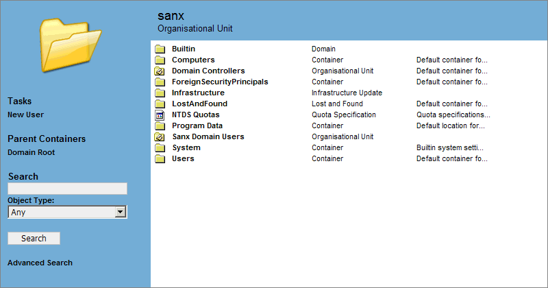



## Active Directory Browser

### Description

This Active Directory browser allows you to browse objects within the Active Directory, delete objects, create and edit user accounts, change group membership ... and a few other things.

The entire code is based around the Active Directory ADSI scripting interface so no compiled objects or custom CGIs are needed. Should you wish to implement your own ADSI code, this project should serve as a good tutorial.

Any questions etc. should be directed to the support forum (registration required) at http://www.sanx.org/forum/
 
### More Info
 
Within the ZIP package is a file called licence.txt. Please read this as it contains important information as to what you need to do to get this code working.

             |
---                |---
**Submitted On**   |2004-04-19 21:45:32
**By**             |[Sanx](https://github.com/Planet-Source-Code/PSCIndex/blob/master/ByAuthor/sanx.md)
**Level**          |Intermediate
**User Rating**    |5.0 (20 globes from 4 users)
**Compatibility**  |ASP \(Active Server Pages\) 
**Category**       |[Internet/ HTML](https://github.com/Planet-Source-Code/PSCIndex/blob/master/ByCategory/internet-html__1-34.md)
**World**          |[Visual Basic](https://github.com/Planet-Source-Code/PSCIndex/blob/master/ByWorld/visual-basic.md)
**Archive File**   |[Active\_Dir175503682004\.zip](https://github.com/Planet-Source-Code/sanx-active-directory-browser__1-54250/archive/master.zip)

